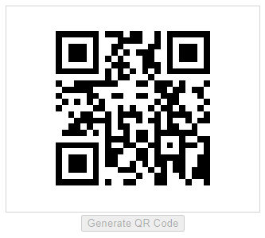

# QR Code Generator

QR Code Generator PCF allows offline / or no external connectors to generate QR codes using minimal dependencies.

Author:

 [Ryan Radford](https://github.com/werkn)

License:

**MIT**

Dependencies: 

[qrcode-svg](https://www.npmjs.com/package/qrcode-svg)